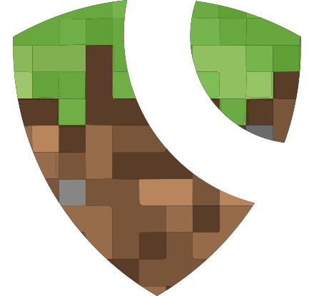

<p align="center">
  
</p>

<p align="center">
  <a href="https://sprax.me/discord">
    
  </a>
  <a href="https://ko-fi.com/spraxdev">
    
  </a>
</p>

<p align="center">
  <a href="https://github.com/Mc-Auth-com/Mc-Auth/actions/workflows/nodejs.yml">
    
  </a>

  <a href="https://sonarcloud.io/summary/new_code?id=Mc-Auth-com_Mc-Auth">
    
  </a>

  <a href="https://sonarcloud.io/summary/new_code?id=Mc-Auth-com_Mc-Auth">
    
  </a>
</p>

# Mc-Auth
Use your Minecraft account to easily log in, without giving your password or email to some random website!
Thanks to Mc-Auth, you can securely log in to third-party services without providing your sensitive data to Mc-Auth!

It aims to be highly transparent to users **and** developers.
Thanks to this transparency, it is easily compliant with most data protection laws
e.g. the **[GDPR](https://en.wikipedia.org/wiki/General_Data_Protection_Regulation)**.

### Another Authentication Service for Minecraft? Really?
I know there is *[minecraft.id](https://minecraft.id/) by inventivetalent* or
*[Minecraft oAuth](https://mc-oauth.net/) by Deftware* (and some more),
but I had something different in mind for my project [SkinDB.net](https://github.com/SkinDB).
They look nice and get the job done, but are lacking information about how your data is treated (e.g. GDPR compliant?).
Another feature I missed was full oAuth2 implementation.
What would normally be done by Mojang as account holders, but they didn't (until now).

So I started reading [RFC 6749](https://tools.ietf.org/html/rfc6749) to understand how oAuth2 works
and has to be implemented => Mc-Auth.com was born!

## How to use Mc-Auth?
If you are a developer, you can check [the documentation](https://github.com/Mc-Auth-com/Mc-Auth/wiki) and find out
more about using Mc-Auth.

If you are a normal Minecraft player and a website or application you are using might find this interesting,
feel free to contact them with a link to this project – While making the Minecraft Community a safer place!


## Setup
Some npm scripts exist for convenience:
* `build`: Builds the project for production
* `build:dev`: Builds the project for development (includes source maps)

* `dev`: Builds and starts the project while watches for file changes to automatically restart
* `test`: Runs the tests

* `snyk`: Uses *snyk* to check the source code for vulnerabilities
* `snyk:docker`: Uses *snyk* to check the production Docker image for vulnerabilities

* `docker:build:prod`: Builds the production Docker image
* `docker:build:dev`: Builds the development Docker image
* `docker:dev`: Builds and starts the development Docker image (container uses host network and mounts local `./storage/` directory)

### Development
You'll need at least Node.js v16 and Linux/Bash is recommended (my npm scripts expect bash).
Additionally, you'll need a PostgreSQL instance
([a local docker container might be an option](https://github.com/docker-library/docs/tree/master/postgres#start-a-postgres-instance)).

Configuration is done inside `./storage/` and interesting npm scripts are `dev`, `build:dev` and `docker:dev`.


## Production
* Please prepare your database by running `./database-setup.sql`
* When you are done, visit
  [Mc-Auth-com/McAuth-BungeeCord](https://github.com/Mc-Auth-com/McAuth-BungeeCord#setup)
  and continue by setting it up too

1. Run `npm run docker:build:prod` (no `npm install` needed)
2. Start the container with something similar to:
   ```shell
   docker run \
   --detach \
   --name mc-auth-web \
   --publish 8080:8080 \
   --volume mc-auth-web-storage:/app/storage/ \
   --volume mc-auth-web-logs:/app/logs/ \
   --cpus 2 \
   --memory 256M \
   --security-opt=no-new-privileges \
   --read-only \
   mc-auth-web:latest
   ```
3. Edit the configuration inside the container at `/app/storage/`


Or without docker:
1. `npm ci`
2. `npm run build`
3. `node ./dist/index.js`
4. Edit the configuration inside `./storage/`


## TODO
* **Recode most parts ([#182](https://github.com/Mc-Auth-com/Mc-Auth/pull/182))**
  * [ ] Redesign how localization files look
  * [X] Recode demo page
  * [X] Cache HTML in memory (for every language)
* Finish settings pages
  * Account
    * [ ] Show public Minecraft account data (as an example, maybe link to SkinDB)
    * [X] Adding and confirming an email address
    * [ ] Export account data
  * Account Security
    * [ ] Show active sessions (+IP, User-Agent, ...)
    * [ ] Show all apps that have been granted access
  * Notification
    * [ ] Allow enabling/disabling email notifications for specific events
  * oAuth Apps
    * [X] Delete button
* [ ] Allow grants to be temporary (60 days without activity by default)
* Fully implement verified applications
  * [ ] Force 2FA when editing verified apps
* When uploading an app icon: Show notification that the user needs to use the 'Save' button
* [ ] Send 'Content Security Policy' header
* [ ] Allow users to report applications (inside authorization screen)
* [ ] Introduce rate limits
* [X] Create documentation/wiki
* Create a Brand/Press Kit with images
  * [ ] With HTML Examples for buttons
* [X] Replace 'Google Analytics'
* [ ] Admin Dashboard


## Thanks To... ✨
<table>
  <tr>
    <td align="center">
      <a href="https://github.com/JNSAPH">
        <!--
        --><br><!--
        --><sub><b>Jonas</b></sub>
      </a>
      <br>
      🎨 Logo and Banner
    </td>
    <td align="center">
      <a href="https://github.com/briannastatic">
        <!--
        --><br><!--
        --><sub><b>Brianna O'Keefe</b></sub>
      </a>
      <br>
      🌍 English Translations
    </td>
  </tr>
</table>

<table>
  <tr>
    <td>
      <a href="https://www.cloudflare.com/" title="Improve page performance and availability">
        <!--
        --><br><!--
        --><sub><b>CloudFlare Free</b></sub>
      </a>
    </td>
    <td>
      <a href="https://www.jetbrains.com/" title="Provides great tools and IDEs">
        <!--
        --><br><!--
        --><sub><b>JetBrains OS License</b></sub>
      </a>
    </td>
  </tr>
</table>
